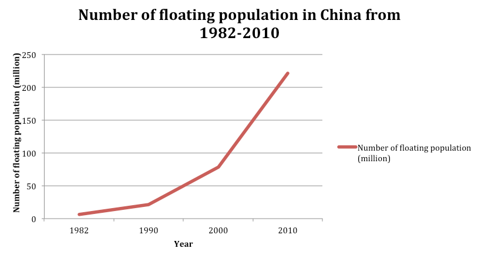
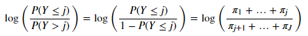
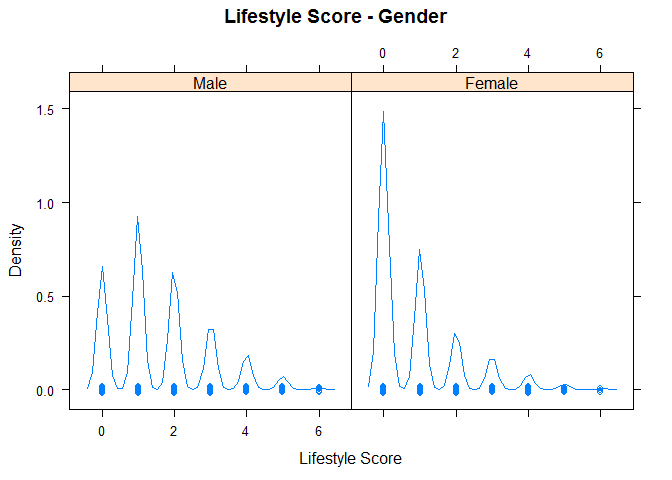
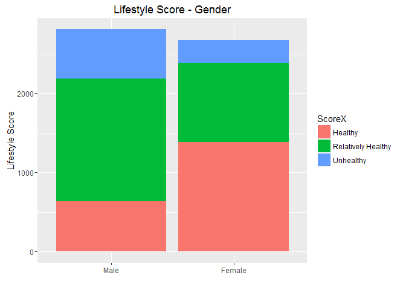
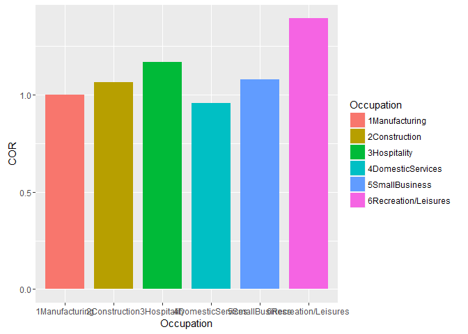
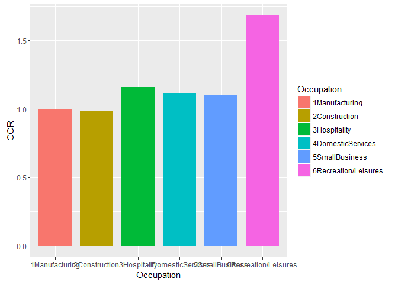
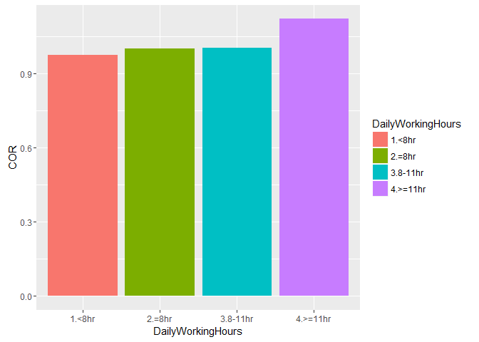
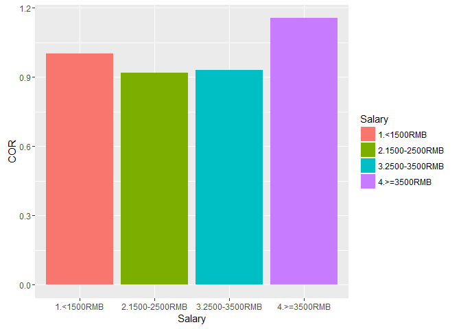

## IS4250 Healthcare Analytics

Health-Related Lifestyle Behaviors among Male and Female Rural-to-Urban Migrant Workers in Shanghai, China

Chen Jiesheng (A0099515U)

Xia Jingyi (A0100125H)

## Content
1. Introduction

    1.1 Paper Background

    1.2 Literature Review

    1.3 Purpose of the Paper

    1.4 Collection and Preparation of Data

    1.5 Statistical Analysis Methods

2. Experiment Replication and Results Comparison
    
    2.1 Data Preparation for Replicating Experiments

    2.2 Socio-demographic characteristics of participants

    2.3 Health status of migrant population

    2.4 Association between lifestyle score and socio-demographic characteristics and physical and mental status

    2.5 Replicate of Experiment Plots

3. Evaluation of the Paper

    3.1 Challenges in the paper

    3.2 Limitations of the paper

    3.3 Contributions of the paper to the field of health

4. Appendix

## 1. Introduction

## 1.1 Paper Background

This _paper Health-Related Lifestyle Behaviors among Male and Female Rural-to-Urban Migrant Workers in Shanghai, China_ is a cross-sectional study between August and October 2012 during which lifestyle behaviors of migrant workers participating in Shanghai are collected and studied. Furthermore, researchers also explored the association between lifestyle scores and contributing demographic factors such as employment, salary, mental health, marital status, and migratory history.

The study subjects are rural-to-urban migrant workers in China, underpinning the unprecedented urbanization movements in human history. According to National Bureau of Statistics of China, there was a total of 252.78 million migrant workers in 2011[^1]. By 2025, this number is expected to increase by another 243 million.ii

 

Fig 1 Number of floating population/ migrant workers in Chinaiii

Migrants in China form the floating population in urban areas. The reason for leaving rural areas to take up jobs in urban area is largely economic. As the economy is booming and coastal cities in China enjoy an astonishing annual growth rate of over 10%, migrant workers can earn much more income in cities than in rural areas. In general, rural-to-urban migrant workers take up laborious manual work in cities because they have received less education in rural areas. Fig 2 compares education levels between urban job seekers and migrant workers. The heavy manual work together with their lack of healthcare programs/ insurance in urban areas makes health problems a looming issue to migrant workers.

 

Fig 2 Education Attainment Comparison

Shanghai is the economic center in China, attracting 6 million migrants annually. By studying the health status of the migrant workers in Shanghai, researchers can shed important lights on the overall health condition of migrant workers in China.

## 1.2 Literature Review

Several previous biomedical papers have influenced and inspired the study of this paper. In _Chronic diseases and health promotion __iv_ and _Health factors and longevity in men and women: a 26-year follow-up study__ v_, health-related lifestyle behaviors are found to be important determinants of disease. In _Patterns of unhealthy behaviour in Finland __vi_, numerous lifestyle behaviors that have impact on health are identified: cigarette smoking, alcohol consumption, physical activity, and diet. And the concept of health scores based on assessment of health-related lifestyle behaviors is first proposed by _Relation between modifiable lifestyle factors and lifetime risk of heart failur__ vii__._ It is evident to see how previous literatures shape the basic ideas and methods of this paper.

In recent years, several literatures have studied the prevalence of infectious diseases, mental health, quality of life and smoking in the migrant workers in China. However, no papers applied the study of lifestyle behavior on migrant workers. As such, the researchers are encouraged to fill in the gap and advance the medical study to a new level: to identify relationships between health scores based on lifestyle behaviors and demographic information of migrant workers.

## 1.3 Purpose of the Paper

Our group identifies three major purposes of the paper:

1. 1.To study the health condition of rural-to-urban migrant workers, a group of people who might have potential health issues due to their job nature and a group of people who received limitation attention in previous biomedical studies
2. 2.To identify the association of health scores, determined by lifestyle behaviors, and demographic information such as occupation and diet information

## 1.4 Collection and Preparation of Data

From August to October 2012, the authors employed a proportionally stratified **multistage cluster random sampling procedure** to recruit participants of migrant workers. They chose to recruit study subjects from four of the eight central and three of the eight fringing districts of Shanghai, and then for each district, one community health service center was randomly chosen. Six common migrant worker occupations are identified: manufacturing, construction, hospitality, domestic service, small business and recreation/ leisure. In each selected health service center, cluster random sampling was conducted according to the workplace and all the eligible workplaces within the service area were classified in three strata based on their employee size. A proportionate number of study subjects was then selected from the three strata respectively.

The study subjects are rural-to-urban migrants who were aged 18-65 years with a residency of at least 6 months. Survey questionnaire was individually administered under supervision. The required sample was 5800. For each volunteer, blood pressure was measured on the spot once.

In the survey, social-demographic characteristics, mental health, physical health and lifestyle behaviors are collected.

**Social-demographic characteristics** include age, gender, occupation, workplace scale, education attainment, marital status, accompanying child, salary, years of residency in Shanghai, number of cities resided in, hours worked per day, days worked per week, income, and type of residents.

**Mental health** is collected using a Chinese version of the Symptom Checklist-90-Revised, a self-reported mental health questionnaire.

**Physical health** includes self-reported height and weight, a history of chronic diseases.

Six types of **lifestyle behaviors** were recorded: smoking habits, alcohol consumption, sleep duration and quality of sleep, breakfast patterns, frequency of regular meals and frequency of fruit and vegetable consumption. Physical activity was not collected by the authors because the authors thought rural-to-urban migrants "mostly engaged in physical labor" and should by nature fulfill physical activity requirement.

After collecting all surveys, based on the six lifestyle behaviors, the authors applied tactics from previous literature to arrive at the 0-6 **lifestyle score**. Each lifestyle behavior was assigned 0 or 1 points. For the overall score, subcategories are as followed: healthy (0 point), relatively healthy (1-2 points), or unhealthy (3-6 points).

## 1.5 Statistical Analysis Methods

The statistical analysis was carried out using SPSS software, version 17.0 and SAS software, version 9.2.

For socio-demographic characteristics and health status (mental and physical), the authors calculated frequencies or mean values and standard deviation by gender. **Chi-square test** was applied to evaluate the differences of frequencies by gender; **un-paired t test** was applied to evaluate the differences of mean values by gender.

A **multiple stepwise cumulative odds logistic regression model** was used to assess the association between unhealthy lifestyle score and multiple risk factors by gender. Healthy lifestyle was used as reference in the model. Independent variables were age, occupation, education attainment, workplace scale, accompanying child, marital status, salary, years of residency, number of cities resided in, hours worked per day, days worked per week, type of residence, self-reported health status, chronic disease, blood pressure, BMI, and mental health.

A 10% significance level is applied so that results with less than 0.05 p-value are considered significant for a two-tailed alpha test.

To understand cumulative odds logistic regression model, we need to first understand a cumulative logit. A cumulative logit is defined as:  

This is the log-odds of two cumulative probabilities, one less-than and the other greater-than type. This measures how likely the response is to be in category j or below versus in a category higher than j. In this paper, categories of j are sub-categories of lifestyle scores: healthy (0 point), relatively healthy (1-2) or unhealthy (3-6 points). It is cumulative because the numerator include all categories less than j.

The cumulative probabilities are given by: P(Y¡Üj)=exp(¦Áj+¦Âx)/(1+exp(¦Áj+¦Âx)). In R, one can use glm() function to perform logistic regression, get confidence interval using confint() function and cumulative odds ratios (COR) can be calculated by applying exp(coef(<logistic regreassion results>)).

#
## 2. Experiment Replication and Results Comparison

Experiments in the paper group statistical analysis results into three categories as follows. We use the dataset in _Health-related lifestyle behaviors among male and female rural-to-urban migrant workers in Shanghai, China.xls_, present in [https://GitHub.com/chenjiesheng226/is4250/tree/tut1/project](https://github.com/chenjiesheng226/is4250/tree/tut1/project) , and _Codebook.xls_ also on the GitHub to replicate the experiments. The software used is R-studio. Datasets used in replicated experiments have some discrepancies with the original datasets used by the authors. Differences include missing values for physical health information such as chronic diseases and possible different records unidentified. As a result, discrepancies should be expected between the original results and our replicate results. For a full reference of the replication source code, you are welcome to refer to the appendix or simply browse the GitHub.

## 2.1 Data Preparation for Replicating Experiments

Convert excel data file into .csv format. Read all data from csv file in R.

OriginalHealthData<- read.csv("C:/Users/ASUS/Documents/Health Data.csv")

healthData<-dplyr::select(OriginalHealthData, everything())

Rename 24 data attributes according to codebook provided.

(Detected some discrepency and several missing attributes such as self-reported health status)

healthData<-dplyr::rename(healthData, Occupation=b1)

healthData<-dplyr::rename(healthData, WorkplaceScale=b2)

healthData<-dplyr::rename(healthData, Gender=q102)

healthData<-dplyr::rename(healthData, Age=q103)

healthData<-dplyr::rename(healthData, MaritalStatus=q104)

healthData<-dplyr::rename(healthData, EducationAttainment=q105)

healthData<-dplyr::rename(healthData, AccompanyChild=q106)

healthData<-dplyr::rename(healthData, Salary=q107)

healthData<-dplyr::rename(healthData, YearsAsMigrant=q108a1)

healthData<-dplyr::rename(healthData, NumberOfCitiesResidedIn=q108a2)

healthData<-dplyr::rename(healthData, DailyWorkingHours=q108b)

healthData<-dplyr::rename(healthData, WeeklyWorkingDays=q108c1)

healthData<-dplyr::rename(healthData, TypeOfResidence=q108c2)

healthData<-dplyr::rename(healthData, HundredCigarettes=q410)

healthData<-dplyr::rename(healthData, CurrentSmoker=q411)

healthData<-dplyr::rename(healthData, NumberOfCigarettesPerDay=q412)

healthData<-dplyr::rename(healthData, DrinkingFrequency=q431)

healthData<-dplyr::rename(healthData, AlcoholDrinksPerDay=q432)

healthData<-dplyr::rename(healthData, SixOrMoreDrinksFrequency=q433)

healthData<-dplyr::rename(healthData, DailySleepingHours=q444)

healthData<-dplyr::rename(healthData, SleepingQuality=q446)

healthData<-dplyr::rename(healthData, DailyBreakfast=q450)

healthData<-dplyr::rename(healthData, DailyFruitsVegetables=q451)

healthData<-dplyr::rename(healthData, DailyRegularMeals=q452)

Compute Mental Health Score:

- ??Read self-assessment scores of q201-q290, 90 questions from Symptom Checklist-90-Revised.
- ??Each question carries 1-5 marks, representing none, mild, moderate, severe, extreme.
- ??Sum up 90 scores

mentalChecklist<-dplyr::select(OriginalHealthData, contains("q2"))

mentalChecklist<-mentalChecklist %>% transmute(MentalHealth=q201+q202+q203+q204+q205+q206+q207+q208+q209+q210+q211+q212+q213+q214+q215+q216+q217+q218+q219+q220+q221+q222+q223+q224+q225+q226+q227+q228+q229+q230+q231+q232+q233+q234+q235+q236+q237+q238+q239+q240+q241+q242+q243+q244+q245+q246+q247+q248+q249+q250+q251+q252+q253+q254+q255+q256+q257+q258+q259+q260+q261+q262+q263+q264+q265+q266+q267+q268+q269+q270+q271+q272+q273+q274+q275+q276+q277+q278+q279+q280+q281+q282+q283+q284+q285+q286+q287+q288+q289+q290)

healthData<-dplyr::bind\_cols(healthData, mentalChecklist)

Compute Drinking Behaviour Score

- ??3 question
  - ooFrequency of drinking
  - ooHow many drinks containing alcohol do you have on a typical day when you are drinking?
  - ooHow often do you have six or more drinks on one occasion?
- ??Each question carries 1-5 marks, representing degree of alcohol consumption
- ??Sum up 3 scores

drinkingStatus<-dplyr::select(healthData, DrinkingFrequency, AlcoholDrinksPerDay, SixOrMoreDrinksFrequency)

drinkingStatus<-drinkingStatus %>% transmute(AlcoholConsumption=DrinkingFrequency+AlcoholDrinksPerDay+SixOrMoreDrinksFrequency-3)

healthData<-dplyr::bind\_cols(healthData, drinkingStatus)

**Further process data (mainly Categorization)**

- ??Education Attainment
  - oo4 catrgories: Elementary or lower, Junior high school, High school, College or above
- ??Gender
  - ooswap sequence into 2 categories: Male, Female
- ??Number of Accompanying Children
  - oo3 categories: No children, Cohabitating children, Children residing elsewhere
- ??Salary
  - oo4 categories: <1500RMB, 1500-2500RMB, 2500-3500RMB, >=3500RMB
- ??Number of Cities Resided in
  - oo2 categories: 1-2, >=3
- ??Daily Working Hours
- ??Weekly Working Days
- ??BMI:
  - ooBMI = weight(kg) / (height(m)^2)
  - oo3 categories: < 18.5; >= 18.5 and < 24; >=24
- ??Mental Health
  - oo2 categories: if MentalHealth score <= 160, Normal; if MentalHealth score > 160, Abnormal
- ??Smoking
  - ooCurrent Smoker
  - oo2 categories: Unhealthy, Healthy
  - ooif smoked in the past 30 days, Unhealthy; else Healthy
- ??Drinking
  - ooHazardous Alcohol Consumption
  - oo2 categories: Unhealthy, Healthy
  - ooif Alcohol Consumption Score >=4 for Male or Alcohol Consumption Score >=3 for Female, Unhealthy; else Healthy
- ??Daily Sleeping Hours
  - oo2 categories: Unhealthy, Healthy
  - ooif Daily Sleeping Hours 7-9 hours/night, Health; else Unhealthy
- ??Sleeping Quality
  - oo2 categories: 1-2 Good/Fair; 3-4 Poor/Very Poor
- ??Daily Breakfasts
  - oo2 categories: Unhealthy, Healthy
  - ooif almost Daily Breakfasts, Health; else Unhealthy
- ??Daily Fruits and Vegetables Consumption
  - oo2 categories: Unhealthy, Healthy
  - ooif almost Daily Fruits and Vegetables Consumption, Health; else Unhealthy
- ??Daily Regular Meals
  - oo2 categories: Unhealthy, Healthy
  - ooif almost Daily Regular Meals, Health; else Unhealthy

healthData<-dplyr::mutate(healthData, EducationAttainmentX= ifelse(EducationAttainment==1, 1, ifelse(EducationAttainment==2, 2, ifelse(EducationAttainment==3, 3, 4))))

healthData<-dplyr::mutate(healthData, BMI=weight/(height/100)/(height/100))

healthData<-dplyr::mutate(healthData, BMIX= ifelse(BMI<18.5, 1, ifelse(BMI<24, 2, 3)))

healthData<-dplyr::mutate(healthData, GenderX= ifelse(Gender==1, 2, 1))

healthData<-dplyr::mutate(healthData, AgeX= ifelse(Age<=32, 1, 2))

healthData<-dplyr::mutate(healthData, AccompanyChildX= ifelse(AccompanyChild==1, 1, ifelse(AccompanyChild==4, 3, 2)))

healthData<-dplyr::mutate(healthData, SalaryX= ifelse(Salary==1, 1, ifelse(Salary==2, 2, ifelse(Salary==3, 3, 4))))

healthData<-dplyr::mutate(healthData, NumberOfCitiesResidedInX= ifelse(NumberOfCitiesResidedIn<=2, 1, 2))

healthData<-dplyr::mutate(healthData, DailyWorkingHoursX= ifelse(DailyWorkingHours==8, 1, ifelse(DailyWorkingHours<8, 2, ifelse(DailyWorkingHours<11, 3, 4))))

healthData<-dplyr::mutate(healthData, WeeklyWorkingDaysX= ifelse(WeeklyWorkingDays<=4, 1, ifelse(WeeklyWorkingDays==5, 2, ifelse(WeeklyWorkingDays==6, 3, 4))))

healthData<-dplyr::mutate(healthData, MentalHealthX= ifelse(MentalHealth<=160, 1, 2))

healthData<-dplyr::mutate(healthData, CurrentSmokerX= ifelse(CurrentSmoker==1| is.na(CurrentSmoker), 0, 1))

healthData<-dplyr::mutate(healthData, HazardousDrinkX= ifelse(AlcoholConsumption>=4, 1, ifelse(GenderX==2&AlcoholConsumption==3, 1, 0)))

healthData<-dplyr::mutate(healthData, DailySleepingHoursX= ifelse(DailySleepingHours<7|DailySleepingHours>9, 1, 0))

healthData<-dplyr::mutate(healthData, SleepingQualityX= ifelse(SleepingQuality<=2, 0, 1))

healthData<-dplyr::mutate(healthData, DailyBreakfastX= ifelse(DailyBreakfast==1, 0, 1))

healthData<-dplyr::mutate(healthData, DailyFruitsVegetablesX= ifelse(DailyFruitsVegetables==1, 0, 1))

healthData<-dplyr::mutate(healthData, DailyRegularMealsX= ifelse(DailyRegularMeals==1, 0, 1))

**Compute Lifestyle Behaviour Score**

- ??6 factors: CurrentSmoker, HazardousDrink, DailySleepingHours, DailyBreakfast, DailyFruitsVegetables, DailyRegularMeals
- ??1 score for every Unhealthy Behavior
- ??Sum: 0, Healthy; 1-2 Relatively Healthy; 3-6 Unhealthy

lifestyleScore<-dplyr::select(healthData, CurrentSmokerX, HazardousDrinkX, DailySleepingHoursX, DailyBreakfastX, DailyFruitsVegetablesX, DailyRegularMealsX)

lifestyleScore<-lifestyleScore %>% transmute(Score=CurrentSmokerX+HazardousDrinkX+DailySleepingHoursX+DailyBreakfastX+DailyFruitsVegetablesX+DailyRegularMealsX)

healthData<-dplyr::bind\_cols(healthData, lifestyleScore)

healthData<-dplyr::mutate(healthData, ScoreX= ifelse(Score==0, 1, ifelse(Score==1|Score==2, 2, 3)))

healthDataTbl<- data.table(healthData)

## 2.2 Socio-demographic characteristics of participants

Chi-square test is used to test any differences of socio-demographic characteristics due to gender. An example of the code snippet applying Chi-square test in R is:

Age <- table(healthDataTbl$AgeX, healthDataTbl$GenderX)

dimnames(Age) <-list(AgeX= c("<=32",">32"), GenderX= c("Male","Female"))

Age

chisq.test(Age,correct=F)

The above code snippet is a chi-square test on the attribute Age.

**Table 1.Comparison of Socio-demographic characteristics of migrant workers by gender**

| VariablesAge (year), mean¡ÀSD | **Original results from the paper** | **Replicated results** |
| --- | --- | --- |
| Male   | Female   | P-value  | Male   | Female   | P-value  |
| Age (years) |   |   |   |   |   |   |
|  ¡Ü32 | 1237 | 1408 | <0.001 | 1237 | 1408 | 1.346e-10  |
|  ¡Ý32 | 1574 | 1265 | 1574 | 1265 |
| Occupation |   |   |   |   |   |   |
|  Manufacturing | 1406 | 1107 | <0.001 | 1406 | 1107 | < 2.2e-16  |
|  Construction | 677 | 92 | 677 | 92 |
|  Hospitality | 148 | 237 | 148 | 237 |
|  Domestic Service | 144 | 430 | 144 | 430 |
|  Small Business | 232 | 403 | 232 | 403 |
|  Recreation/ leisure | 204 | 404 | 204 | 404 |
| Workplace scale |   |   |   |   |   |   |
|  Large | 851 | 649 | <0.001 | 851 | 649 | < 2.2e-16  |
|  Moderate | 1101 | 841 | 1101 | 841 |   |
|  Small | 859 | 1183 | 859 | 1183 |   |
| Education attainment |   |   |   |   |   |   |
|  Elementary or lower | 393 | 611 | <0.001 | 393 | 611 | < 2.2e-16  |
|  Junior high school | 1409 | 1380 | 1409 | 1380 |
|  High school | 777 | 543 | 777 | 543 |
|  College | 232 | 139 | 232 | 139 |
| Marital status |   |   |   |   |   |   |
|  Married | 2042 | 1977 | 0.179 | 2042 | 1977 | 0.179  |
|  Single | 700 | 631 | 700 | 631 |
|  Cohabitating | 39 | 47 | 39 | 47 |
|  Divorced or widowed | 30 | 18 | 30 | 18 |
| Accompanying child |   |   |   |   |   |   |
|  No children | 849 | 796 | <0.001 | 849 | 796 | 0.0001234 |
|  Cohabiting children | 878 | 968 | 878 | 968 |
|  Children residing elsewhere | 1084 | 909 | 1084 | 909 |
| Salary |   |   |   |   |   |   |
|  <1500 RMB | 168 | 317 | <0.001 | 168 | 317 | < 2.2e-16  |
|  1500-2500 RMB | 1036 | 1492 | 1036 | 1492 |
|  2500-3500 RMB | 1071 | 628 | 1071 | 628 |
|  ¡Ý3500 RMB | 536 | 236 | 536 | 236 |
| Years of residency |   |   |   |   |   |   |
|  <1 | **365** | **370** | **<0.001** | **Missing** | **Missing** | **Missing**   |
|  1-5 | **1165** | **1267** | **Missing** | **Missing** |
|  ¡Ý5 | **1281** | **1036** | **Missing** | **Missing** |
| Number of city stayed |   |   |   |   |   |   |
|  1-2 | 1859 | 2207 | <0.001 | 1859 | 2207 | < 2.2e-16  |
|  ¡Ý3 | 952 | 464 |   | 952 | 464 |
| Daily working hours |   |   |   |   |   |   |
|  <8 | 18 | 62 | **0.933** | 18 | 62 | **< 2.2e-16**   |
|  =8 | 1273 | 1310 | 1273 | 1310 |
|  8-11 | 1066 | 615 | 1066 | 615 |
|  ¡Ý11 | 454 | 686 | 454 | 686 |
| Weekly working days |   |   |   |   |   |   |
|  ¡Ü4 | 57 | 99 | <0.001 | 57 | 99 | 3.652e-16  |
|  5 | 805 | 759 | 805 | 759 |
|  6 | 1046 | 1201 | 1046 | 1201 |
|  7 | 903 | 614 | 903 | 614 |
| Type of residence |   |   |   |   |   |   |
|  Collective dormitory | 1040 | 515 | <0.001 | 1040 | 515 | < 2.2e-16  |
|  Renting with others | 324 | 312 | 324 | 312 |
|  Renting as a family | 897 | 1400 | 897 | 1400 |
|  Renting alone | 430 | 324 | 430 | 324 |
|  Owning a living place | 120 | 122 | 120 | 122 |

Table 1 compares the experiment results from the original paper with our replication. Discrepancies are highlighted in bold. It can be noted that discrepancies are identified in two socio-demographic characteristics: Years of residency, Daily working hours. For Years of residency, the relevant data is missing so we cannot replicate the experiment results. For Daily working hours, p-value differs such that it is significant in our replication, but insignificant in the paper. We actually think our results are more likely since the p-value of 0.933 in the original paper is also far from the other p-values. Nonetheless, possible sources of differences could be the difference in dataset or the difference in software used for experiments. In the original paper, the authors applied SPSS and SAS for statistical analysis.

Source codes used in the replication of experiments are included in the appendix. You can also refer to a md file on the GitHub ( [https://GitHub.com/xiajingyi/IS4250/blob/master/project\_code.md](https://github.com/xiajingyi/IS4250/blob/master/project_code.md) ) to review the replication results.

## 2.3 Health status of migrant population

In this section, the author applies the same Chi-square as the previous section, so code snippet is omitted here.

**Table 2. Comparison of physical and mental status and lifestyle behavior of migrants by gender**

| Variables | **Original results from the paper** | **Replicated results** |
| --- | --- | --- |
| Male (n=2811) | Female n=2673) | P-value | Male (n=2811) | Female n=2673) | P-value |
| **Health status** |   |   |   |   |   |   |
| Self-reported health status |   |   |   |   |   |   |
|  Good | **2194** | **2084** | **0.966** | **Missing** | **Missing** | **Missing** |
|  Fair | **585** | **563** | **Missing** | **Missing** |
|  Poor | **32** | **26** | **Missing** | **Missing** |
| Chronic diseases | **266** | **183** | **<0.001** | **Missing** | **Missing** |
| Abnormal blood pressure | **401** | **144** | **<0.001** | **Missing** | **Missing** |
| BMI |   |   |   |   |   |   |
|  Underweight | **114** | **232** | <0.001 | **108** | **238** | < 2.2e-16 |
|  Normal | **1775** | **1880** | **1785** | **1883** |
|  Overweight/ obesity | **922** | **561** | **918** | **552** |
| **Mental state** |   |   |   |   |   |   |
|  Normal | **2501** | **2369** | **0.686** | **2508** | **2378** | **0.76** |
|  Abnormal | **310** | **304** | **303** | **295** |
| **Lifestyle behaviors** |   |   |   |   |   |   |
| Smoking status |   |   |   |   |   |   |
|  Previous smoker/ never smoked | 1489 | 2611 | <0.001 | 1489 | 2611 | < 2.2e-16 |
|  Current smoker | 1322 | 62 | 1322 | 62 |
| Alcohol consumption |   |   |   |   |   |   |
|  Nonhazardous alcohol use | **1979** | **2456** | <0.001 | **1980** | **2458** | < 2.2e-16 |
|  Hazardous alcohol use | **832** | **217** | **831** | **215** |
| Sleep |   |   |   |   |   |   |
|  7-9 hours/ night | **2166** | **2107** | 0.114 | **2165** | **2105** | 0.1226 |
|  <7 or >9 hours/night | **645** | **566** | **646** | **568** |
| Good or fair quality sleep | 2474 | 2341 | 0.625 | Missing | Missing | Missing |
| Poor or very poor quality sleep | 337 | 332 | Missing | Missing |
| Diet |   |   |   |   |   |   |
|  Almost daily breakfast | 2302 | 2156 | 0.241 | 2302 | 2156 | 0.2414 |
|  Almost daily fruit & vegetable consumption | 2101 | 2149 | <0.001 | 2101 | 2149 | 5.384e-07 |
|  Almost daily regular meals | 2398 | 2244 | 0.613 | 2398 | 2244 | 0.1635 |
| Lifestyle score |   |   |   |   |   |   |
|  Healthy | 640 | 1386 | <0.001 | 640 | 1385 | < 2.2e-16 |
| Relatively healthy | 1545 | 1000 | 1544 | 1001 |
| Unhealthy | 626 | 287 | 627 | 287 |

Differences between original experiments and the replicated experiment results are highlighted in bold. Generally, the differences are very small within 5%. This could be due to differences software used conducting the experiments.

## 2.4 Association between lifestyle score and socio-demographic characteristics and physical and mental status

Here, the authors apply the logistic regression, get the cumulative odds ratio, calculate 95% confidence interval and filter significant findings based on whether p-value is less than 5%. A code snippet on getting all the data in Table 3 is provided below:

Male<-dplyr::filter(healthData, GenderX==1)

AGE1<- cut(Male$AgeX, c(0.5, 1.5,2.5), labels= c("<=32",">32"))

OCCUPATION1<- cut(Male$Occupation, c(0.5, 1.5,2.5,3.5,4.5,5.5, 6.5), labels= c("Manufacturing", "Construction", "Hospitality", "DomesticSservices", "SmallBusiness", "Recreation/Leisures"))

WORKPLACESCALE1<- cut(Male$WorkplaceScale, c(0.5, 1.5,2.5,3.5), labels= c("Large","Moderate","Small"))

EDUCATIONATTAINMENT1<- cut(Male$EducationAttainmentX, c(0.5, 1.5,2.5,3.5,4.5), labels= c("Elementary/Lower","JuniorHigh","HighSchool","College"))

MARITALSTATUS1<- cut(Male$MaritalStatus, c(0.5, 1.5,2.5,3.5,4.5), labels= c("Married", "Single","Cohabitating","Divorced/Widowed"))

ACCOMPANYCHILD1<- cut(Male$AccompanyChildX, c(0.5, 1.5,2.5,3.5), labels= c("NoChildren","Cohabitate","ResideElsewhere"))

SALARY1<- cut(Male$SalaryX, c(0.5, 1.5,2.5,3.5,4.5), labels= c("<1500RMB","1500-2500RMB","2500-3500RMB",">=3500RMB"))

NUMBEROFCITIESRESIDEDIN1<- cut(Male$NumberOfCitiesResidedInX, c(0.5, 1.5,2.5), labels= c("1-2", ">=3"))

DAILYWORKINGHOURS1<- cut(Male$DailyWorkingHoursX, c(0.5, 1.5,2.5,3.5,4.5), labels= c("=8","<8","8-11",">=11"))

WEEKLYWORKINGDAYS1<- cut(Male$WeeklyWorkingDaysX, c(0.5, 1.5,2.5,3.5,4.5), labels= c("<=4","5","6","7"))

RESIDENCE1<- cut(Male$TypeOfResidence, c(0.5, 1.5,2.5,3.5,4.5,5.5), labels= c("CollectiveDormitory", "Rent(with others)", "Rent(family)", "Rent(alone)", "OwnLivingPlace"))

BMI1<- cut(Male$BMIX, c(0.5, 1.5,2.5,3.5), labels= c("Underweight", "NormalWeight", "Overweight"))

MENTALHEALTH1<- cut(Male$MentalHealthX, c(0.5, 1.5,2.5), labels= c("Normal", "Abnormal"))

test1<- glm(ScoreX~AGE1+OCCUPATION1+WORKPLACESCALE1+EDUCATIONATTAINMENT1+MARITALSTATUS1  +ACCOMPANYCHILD1+SALARY1+NUMBEROFCITIESRESIDEDIN1+DAILYWORKINGHOURS1+WEEKLYWORKINGDAYS1+RESIDENCE1+BMI1+MENTALHEALTH1, data=Male)

summary(test1)

ci1<- confint(test1)

exp(cbind(COR= coef(test1), ci1))

**Table 3. Comparison of multiple stepwise cumulative odds logistic regression of lifestyle score with socio-demographic characteristics and physical and mental status for male**

| Independent variables | Male |
| --- | --- |
| **Results from Original Paper** | **Replicated experiment results** |
| COR | 95% CI | P | COR | 95% CI | P |
| Occupation |   |   |   |   |   |   |
|  Manufacturing | 1.0 |   |   | 1.0 |   |   |
|  Construction | 1.216 | 0.992-1.489 | 0.059 | 1.0651334 | 0.986-1.151 | 0.11081     |
|  Hospitality | 1.806 | 1.275-2.559 | <0.001 | 1.1669024 | 1.038-1.312 | 0.00999 |
|  Domestic service | 0.849 | 0.604-1.193 | 0.344 | 0.9563699 | 0.853-1.075 | 0.44568     |
|  Small business | 1.183 | 0.891-1.570 | 0.244 | 1.0786757 | 0.978-1.189 | 0.12816     |
|  Recreation/leisure | 3.248 | 2.379-4.435 | <0.001 | 1.3927085 | 1.253-1.548 | 9.18e-10 |
| Work place scale |   |   |   |   |   |   |
|  Large | 1.0 |   |   | 1.0 |   |   |
|  Moderate | 0.965 | 0.802-1.161 | 0.702 | 0.9919265 | 0.932-1.056 | 0.80034     |
|  Small | 1.422 | 1.154-1.752 | <0.001 | 1.1223432 | 1.047-1.203 | 0.00120 |
| Hours worked per day |   |   |   |   |   |   |
|  <8 | 0.952 | 0.384-2.359 | 0.915 | 0.9747957 | 0.720-1.320 | 0.86894     |
|  =8 | 1.0 |   |   | 1.0 |   |   |
|  8-11 | 1.074 | 0.907-1.273 | 0.406 | 1.0039951 | 0.945-1.067 | 0.89748     |
|  ¡Ý11 | 1.533 | 1.238-1.898 | <0.001 | 1.1209372 | 1.037-1.211 | 0.00386 |
| Mental status |   |   |   |   |   |   |
|  Normal | 1.0 |   |   | 1.0 |   |   |
|  Abnormal | 3.105 | 2.454-3.930 | <0.001 | 1.4310271 | 1.323-1.548 | < 2e-16 |

The table three compares original experiment results for male migrant workers with our replicating experiment results for male migrant workers. Only several independent variables are listed because in the original experiment, the authors apply 10% significance level for a two-tailed test, and to entering effect, p-value needs to be less than 5% threshold. And the original paper also did not provide any experiment results for independent variables not entering into effect, so we do not include any other less significant results. (But they will be present in appendix and on GitHub).

The above table has discrepancies in terms of COR (Cumulative Odds Ratio), 95% Confidence Interval and P-value. This is expected because of two reasons: 1) the dataset used for replicating experiments is not the exact dataset used in the original experiment: some of the data fields like physical health status are missing 2) the original analysis was conducted using SPSS and SAS, while replicating experiments adopt R in our case. There could be software domain difference in terms of the way logistic regression works for minor differences. Nevertheless, the replication is still valuable in the sense that the ranking of COR within each independent variable still coincide with the original experiment results. For example, original experiments show highest COR for "Recreation/leisure" occupation (COR = 3.248) and lowest COR for "Domestic Service" (COR = 0.849). This coincides with the replicated experiment results with "Recreation/leisure" having the highest COR (COR = 1.389) and "Domestic Service" having the lowest COR (COR = 0956). Similarly, the p-values are also more or less comparable: when original papers indicate a significant p-value of less than 5%, the replicated experiments show a less than 5% p-value.

A point to notice for the multiple stepwise cumulative odds ratio is that within each independent variables such as Occupation or Mental status, there will be a sub-category with COR = 1.0. This indicates that the software uses that particular sub-category as a reference level and calculates CORs for other sub-categories relative to the value.

Likewise, a comparison between original experiments and replicated results for female migrant workers are shown in the below table: table 4.

**Table 4. Comparison of Multiple stepwise cumulative odds logistic regression of lifestyle score with socio-demographic characteristics and physical and mental status for female**

| Independent variables | Female |
| --- | --- |
| **Results from Original Paper** | **Replicated experiment results** |
| COR | 95% CI | P | COR | 95% CI | P |
| Occupation |   |   |   |   |   |   |
|  Manufacturing | 1.0 |   |   | 1.0 |   |   |
|  Construction | 1.043 | 0.669-1.627 | 0.853 | 0.9787387 | 0.848-1.129 | 0.768600         |
|  Hospitality | 1.675 | 1.263-2.222 | <0.001 | 1.1584592 | 1.056-1.270 | 0.001798 |
|  Domestic service | 1.657 | 1.314-2.090 | <0.001 | 1.1146430 | 1.032-1.204 | 0.005589 |
|  Small business | 1.556 | 1.222-1.981 | <0.001 | 1.1034555 | 1.014-1.201 | 0.022675 |
|  Recreation/leisure | 5.563 | 4.268-7.250 | <0.001 | 1.6781331 | 1.534-1.835 | < 2e-16 |
| Marital Status |   |   |   |   |   |   |
|  Married | 1.0 |   |   | 1.0 |   |   |
|  Single | 2.023 | 1.664-2.461 | <0.001 | 1.2135993 | 1.098-1.341 | 0.000147 |
|  Cohabitating | 1.564 | 0.873-2.803 | 0.133 | 1.1061900 | 0.911-1.343 | 0.307682     |
|  Divorced/ widowed | 1.533 | 0.621-3.784 | 0.355 | 1.1118359 | 0.836-1.478 | 0.465661     |
| Salary |   |   |   |   |   |   |
|  <1500 RMB | 1.0 |   |   | 1.0 |   |   |
|  1500-2500 RMB | 0.817 | 0.638-1.046 | 0.109 | 0.9193689 | 0.852-0.992 | 0.030019 |
|  2500-3000 RMB | 0.822 | 0.622-1.085 | 0.166 | 0.9299730 | 0.853-1.014 | 0.099298 |
|  ¡Ý3500 RMB | 1.618 | 1.137-2.303 | 0.008 | 1.1547884 | 1.031-1.293 | 0.012616 |
| Number of cities experienced |   |   |   |   |   |   |
|  1-2 | 1.0 |   |   | 1.0 |   |   |
|  ¡Ý3 | 1.311 | 1.072-1.602 | 0.008 | 1.0890634 | 1.024-1.159 | 0.007033 |
| Hours worked per day |   |   |   |   |   |   |
|  <8 | 1.296 | 0.781-2.151 | 0.316 | 1.0464129 | 0.893-1.226 | 0.575049     |
|  =8 | 1.0 |   |   | 1.0 |   |   |
|  8-11 | 1.426 | 1.172-1.734 | <0.001 | 1.0785105 | 1.013-1.149 | 0.018625 |
|  ¡Ý11 | 1.287 | 1.055-1.569 | 0.013 | 1.0507422 | 0.983-1.123 | 0.146106     |
| Mental status |   |   |   |   |   |   |
|  Normal | 1.0 |   |   | 1.0 |   |   |
|  Abnormal | 2.566 | 2.024-3.252 | <0.001 | 1.3779398 | 1.279-1.485 | < 2e-16 |

Just as the comparison for male in table 3, in table 4, even though the exact values differ between original experiments and replicated experiments, the order of ranking within each independent variable is consistent.

## 2.5 Replicate of Experiment Plots

The original paper does not include any experiment plot but three tables summarizing the results of statistical analysis. The three tables are exactly replicated in the previous section. Nonetheless, we feel that the original paper could benefit from inclusion of several plots to express the authors' ideas. Therefore, we include our plots in this paper. The complete replication of the paper's statistical analysis and experiment plots is included in appendix.

 

Fig 3. Density Graph of Lifestyle Score by Gender

Fig 3 shows the direct view of density distribution of lifestyle score in male and female migrants respectively. It is not hard to find siginificant difference across the gender that female migrant workers have a siginificantly larger percentage of people getting 0 for lifestyle score, which in the paper represents healthy lifestyle behaviors.

 

Fig 4. Lifestyle Score Composition Bar Chart by Gender

In Fig 4, a detailed bar chart showning lifestyle score composition compares male and female migrant workers directly. Male migrant workers have lower percentage of people classified as unhealthy (lifestyle score = 0), higher percentage of people classified as relatively healthy (lifestyle score from 1 to 2) and as unhealthy (lifestyle score from 3 to 6).

Next, two selcted plots showing significant risk factors influencing cumulative odds ratios (COR) for male and femals are displayed below.

  

Fig 5. COR against Six Occupations for male migrant workers

Fig 5 shows that male migrant workers in recreation/ leisure industry are the most likely to have unhealthy lifestyle behaviors than their counterparts in other industry as the replicated experiment results suggest, followed by migrants working in hospitality industry.

  

Fig 6. COR against Six Occupations for Female Migrant Workers

The same trend shows up in female migrant workers and again females working in recreation/ leisure sector and hospitality industry are more related to unhealthy lifestyle.

  

Fig 7. COR against Daily Working Hours for Male Migrant Workers

Fig 7 shows that male migrant workers working over 11 hours a day are the most likely to have unhealthy lifestyle behaviors than others.

  

Fig 8. COR against Salary for Female Migrant Workers

Fig 8 shows that female migrant workers earning over 3500 RMB monthly are the most likely group within females to have unhealthy lifestyle behaviors.

A complete set of the experiment plots can be found on our GitHub ( [https://GitHub.com/chenjiesheng226/is4250/tree/tut1/project](https://github.com/chenjiesheng226/is4250/tree/tut1/project) ).

#
## 3. Evaluation of the Paper

## 3.1 Challenges in the paper

The major challenge faced by the authors is to conceive and design the ideas of the experiment conducted which required the authors to put together bits and pieces from all over the place: lifestyle behaviors, health conditions, socio-demographic or other risk factors, and lifestyle scores. The statistical analysis that follows is a piece of cake once the experiment is designed.

In addition, authors of the paper faced some challenges in terms of collecting and preparing data from rural-to-urban migrant workers. Collecting a 13-page survey questionnaire for about 5800 participants requires considerable efforts, let alone the efforts to select the most representative sample from the migrant population. During the survey, some migrant workers had difficulty completing the questionnaire due to their limited years of education. As such, the authors need to provide assistance to them.

## 3.2 Limitations of the paper

The paper suffers from three major limitations:

1. 1)The authors collected lifestyle data only from migrant workers not from non-migrant Shanghaiese residents. The implication is that no comparisons can be drawn before these two groups.
2. 2)Self-reported lifestyle information in combination with physician-diagnosed chronic diseases may have resulted in some misclassifications and information bias.
3. 3)The study is cross-sectional in nature, resulting in only association was drawn, not the causation. In order to better understand the causation between health and risk factors, longitudinal studies should be considered.

## 3.3 Contributions of the paper to the field of health

The paper is the first comprehensive study which strives to find association between lifestyle behaviors and health conditions in a population of rural-to-urban migrant workers of China. Previous literatures were concerned with the prevalence of infectious diseases, mental health, quality of life and smoking in the migrant workers of China. Nevertheless, there is a shortage of healthcare papers on this population in China due to the lack of credible data sources. On the other hand, migrant workers in China are important healthcare research subjects because 1) the number is gigantic in magnitude: about 250 million in 2011, and 2) they are susceptible to health problems like chronic diseases, physical and mental health problems due to their largely physical and manual work nature. In light of this, the paper is a forerunner in discussing health related issues with the migrant workers in China.

The paper is instrumental in directing possible future studies. Firstly, a comparison of health status between city residents and migrant workers can shed lights on healthcare inequality across the two groups in China. Secondly, longitudinal studies using the same lifestyle data and approaches will be helpful to identify causal relationship between health and lifestyle behaviors in general.

#
## 4.

## Appendix

All source codes are available at [https://github.com/xiajingyi/IS4250/blob/master/Project/project\_code.Rmd](https://github.com/xiajingyi/IS4250/blob/master/Project/project_code.Rmd)

Experiment results and plots are available at [https://github.com/xiajingyi/IS4250/blob/master/Project/project\_code.md](https://github.com/xiajingyi/IS4250/blob/master/Project/project_code.md)

[^1]: National Bureau of Statistics of China (2012): "Statistical Communiqu¨¦ on the 2011 National Economic and Social Development" [http://www.stats.gov.cn/english/NewsEvents/201202/t20120222\_26575.html](http://www.stats.gov.cn/english/NewsEvents/201202/t20120222_26575.html).

i

#
 National Bureau of Statistics of China (2012): "Statistical Communiqu¨¦ on the 2011 National Economic and Social Development" [http://www.stats.gov.cn/english/NewsEvents/201202/t20120222\_26575.html](http://www.stats.gov.cn/english/NewsEvents/201202/t20120222_26575.html).

ii

#
 Shanghai, Geoff Dyer in (2008-03-23).  ["China braced for wave of urban migrants"](http://www.ft.com/cms/s/0/c11a84ca-f902-11dc-bcf3-000077b07658.html). _Financial Times_.  [ISSN](https://en.wikipedia.org/wiki/International_Standard_Serial_Number)  [0307-1766](https://www.worldcat.org/issn/0307-1766).

iii

#
 Statistical data are adapted from Zai Liang's presentation in the United Nations in 2012, titled Recent Migration Trends in China: Geographic and Demographic Aspects and Development Implications, as quoting the Tabulation on the Population Census of China in 1982, 1990, 2000 and 2010, published by China's National Bureau of Statistics.

iv

#
Centers for Disease Control and Prevention (2013) Chronic diseases and health promotion. Available:

http://www.cdc.gov/chronicdisease/overview/index.htm.

v

#
 Carlsson AC, Theobald H, Wandell PE (2010) Health factors and longevity in men and women: a 26-

year follow-up study. European journal of epidemiology 25: 547¨C551. doi: 10.1007/s10654-010-9472-2

PMID: 20623324

vi

#
Laaksonen M, Prattala R, Karisto A (2001) Patterns of unhealthy behaviour in Finland. Eur J Public

Health 11: 294¨C300. PMID: 11582610

vii

#
 Djousse L, Driver JA, Gaziano JM (2009) Relation between modifiable lifestyle factors and lifetime risk of heart failure. JAMA: J Am Med Assoc 302: 394¨C400.