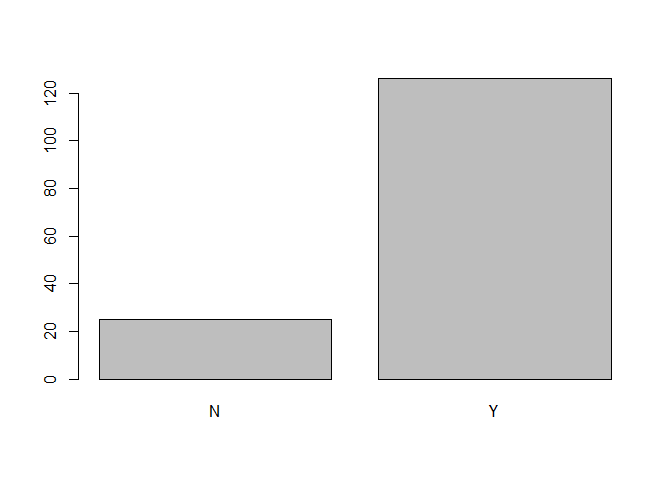
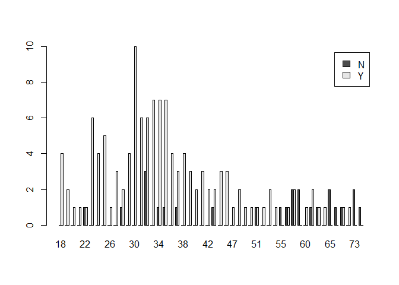
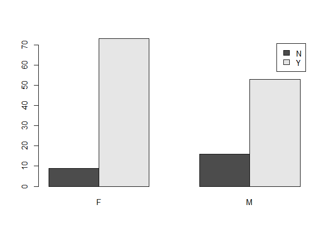

    ## Warning: package 'ggplot2' was built under R version 3.2.3

    ## Warning: package 'dplyr' was built under R version 3.2.3

1.  1.  For Waiting Time:

<!-- -->

    ## [1] 70

  
 For Service Satisfaction

    ## Source: local data frame [2 x 2]
    ## 
    ##   SvcSat     n
    ##   (fctr) (int)
    ## 1      N    25
    ## 2      Y   126

    ##         Y 
    ## 0.8344371

  
 (b) Is there any statistical evidence to suggest differences in service
satisfaction for age and gender?

For age:   
From the graph above, the aged populations are more likely to be
unsatisfied.

For gender:
  
Gender wise, males are more likely to be unsatisfied.

Statistical Evidence:

    ## 
    ## Call:
    ## lm(formula = var1 ~ var2 + var3)
    ## 
    ## Coefficients:
    ## (Intercept)         var2         var3  
    ##     1.32733     -0.07500     -0.01197

    ## 
    ## Call:
    ## lm(formula = var1 ~ var2 + var3)
    ## 
    ## Residuals:
    ##      Min       1Q   Median       3Q      Max 
    ## -0.98897 -0.03686  0.06771  0.17264  0.51381 
    ## 
    ## Coefficients:
    ##              Estimate Std. Error t value Pr(>|t|)    
    ## (Intercept)  1.327333   0.082951  16.001  < 2e-16 ***
    ## var2        -0.074997   0.055062  -1.362    0.175    
    ## var3        -0.011971   0.002036  -5.880 2.62e-08 ***
    ## ---
    ## Signif. codes:  0 '***' 0.001 '**' 0.01 '*' 0.05 '.' 0.1 ' ' 1
    ## 
    ## Residual standard error: 0.3335 on 148 degrees of freedom
    ## Multiple R-squared:  0.2111, Adjusted R-squared:  0.2005 
    ## F-statistic:  19.8 on 2 and 148 DF,  p-value: 2.394e-08

However, the differences with gender is insignificant as shown above.

1.  

<!-- -->

    ## [1] -0.5293395

Hence, the longer the waiting time, the more dissatisfied customers will
be.

1.  

<!-- -->

    ## Warning: 强制改变过程中产生了NA

    ## [1] NA

1.  

<!-- -->

    ## 
    ## Call:
    ## lm(formula = c$bmi ~ var1 + var2 + c$AGE + c$SBP + c$TC)
    ## 
    ## Coefficients:
    ## (Intercept)         var1         var2        c$AGE        c$SBP  
    ##    10.12256     -0.89042      0.62397      0.01976      0.08618  
    ##     c$TC112      c$TC115      c$TC123      c$TC129      c$TC131  
    ##    -4.81516     -0.81701      2.98765      3.71970     -1.70116  
    ##     c$TC140      c$TC142      c$TC144      c$TC147      c$TC149  
    ##     0.73666      3.05286      0.34188      0.43957     -6.85032  
    ##     c$TC153      c$TC160      c$TC161      c$TC162      c$TC163  
    ##     1.85015      0.67713      1.23300      2.12541      1.16599  
    ##     c$TC165      c$TC166      c$TC167      c$TC168      c$TC169  
    ##    -0.38701      3.99932      0.66336     -0.49193      5.62090  
    ##     c$TC170      c$TC175      c$TC177      c$TC178      c$TC179  
    ##    -0.92818     -0.10238     -0.22174     -0.60029     -0.36517  
    ##     c$TC180      c$TC182      c$TC184      c$TC185      c$TC186  
    ##     4.39007      2.99240      1.48417      5.85425      0.15376  
    ##     c$TC187      c$TC188      c$TC189      c$TC190      c$TC191  
    ##     0.49182     -2.54038      0.50903      1.00722      4.27110  
    ##     c$TC193      c$TC194      c$TC195      c$TC196      c$TC198  
    ##     3.12262      0.19369     -0.01423      3.64493     -4.31736  
    ##     c$TC199      c$TC200      c$TC201      c$TC202      c$TC203  
    ##     1.46458     -0.20629      4.18923      4.27159     -1.18684  
    ##     c$TC205      c$TC207      c$TC208      c$TC209      c$TC210  
    ##     5.55911     -2.53717     -1.95839      1.05380      0.27302  
    ##     c$TC212      c$TC213      c$TC214      c$TC215      c$TC216  
    ##     2.22382      8.34155      2.87521      3.75384      2.45044  
    ##     c$TC218      c$TC219      c$TC220      c$TC221      c$TC222  
    ##     5.02661      3.08155      9.38949      3.10654      3.29313  
    ##     c$TC223      c$TC224      c$TC225      c$TC226      c$TC230  
    ##     2.92850     -0.52061      7.98536      2.54412      1.51649  
    ##     c$TC231      c$TC233      c$TC234      c$TC236      c$TC237  
    ##     0.89786      1.02633      4.50574      4.52278      6.65940  
    ##     c$TC238      c$TC239      c$TC240      c$TC242      c$TC243  
    ##     7.26511      0.90792      2.39685     -0.04005      6.96086  
    ##     c$TC245      c$TC246      c$TC248      c$TC250      c$TC253  
    ##     3.45982      7.01486      4.20651      2.64701      9.16578  
    ##     c$TC254      c$TC255      c$TC256      c$TC257      c$TC260  
    ##     2.37006      4.29871      7.47247     -0.21559     -3.32266  
    ##     c$TC261      c$TC264      c$TC272      c$TC273      c$TC280  
    ##    -0.41118      7.77706      7.91634      6.44308      7.35416  
    ##     c$TC283      c$TC287      c$TC288      c$TC290      c$TC291  
    ##     4.48779     14.15092      4.27525      0.98218      5.37823  
    ##     c$TC293      c$TC296      c$TC297      c$TC299      c$TC308  
    ##     1.27283      7.58057      2.92420      9.09008      6.71888  
    ##     c$TC315      c$TC327       c$TCna  
    ##     1.57123      8.76942      1.14858

    ## 
    ## Call:
    ## lm(formula = c$bmi ~ var1 + var2 + c$AGE + c$SBP + c$TC)
    ## 
    ## Residuals:
    ##     Min      1Q  Median      3Q     Max 
    ## -4.6897 -0.0121  0.0000  0.0834  5.8426 
    ## 
    ## Coefficients:
    ##             Estimate Std. Error t value Pr(>|t|)   
    ## (Intercept) 10.12256    4.20721   2.406  0.02050 * 
    ## var1        -0.89042    1.04455  -0.852  0.39869   
    ## var2         0.62397    0.96084   0.649  0.51953   
    ## c$AGE        0.01976    0.04456   0.444  0.65960   
    ## c$SBP        0.08618    0.03137   2.747  0.00874 **
    ## c$TC112     -4.81516    4.56515  -1.055  0.29742   
    ## c$TC115     -0.81701    4.51706  -0.181  0.85732   
    ## c$TC123      2.98765    4.43890   0.673  0.50451   
    ## c$TC129      3.71970    4.33817   0.857  0.39596   
    ## c$TC131     -1.70116    3.98540  -0.427  0.67162   
    ## c$TC140      0.73666    3.90762   0.189  0.85136   
    ## c$TC142      3.05286    4.52163   0.675  0.50318   
    ## c$TC144      0.34188    4.44508   0.077  0.93905   
    ## c$TC147      0.43957    4.55230   0.097  0.92352   
    ## c$TC149     -6.85032    4.42828  -1.547  0.12920   
    ## c$TC153      1.85015    4.58109   0.404  0.68831   
    ## c$TC160      0.67713    4.52211   0.150  0.88167   
    ## c$TC161      1.23300    4.45537   0.277  0.78330   
    ## c$TC162      2.12541    4.83651   0.439  0.66254   
    ## c$TC163      1.16599    4.55744   0.256  0.79929   
    ## c$TC165     -0.38701    3.50973  -0.110  0.91271   
    ## c$TC166      3.99932    3.90342   1.025  0.31130   
    ## c$TC167      0.66336    4.62935   0.143  0.88673   
    ## c$TC168     -0.49193    4.47744  -0.110  0.91303   
    ## c$TC169      5.62090    4.32864   1.299  0.20102   
    ## c$TC170     -0.92818    4.45530  -0.208  0.83595   
    ## c$TC175     -0.10238    3.91887  -0.026  0.97928   
    ## c$TC177     -0.22174    3.71329  -0.060  0.95266   
    ## c$TC178     -0.60029    4.49825  -0.133  0.89446   
    ## c$TC179     -0.36517    4.47378  -0.082  0.93532   
    ## c$TC180      4.39007    4.48909   0.978  0.33357   
    ## c$TC182      2.99240    4.87624   0.614  0.54267   
    ## c$TC184      1.48417    4.01245   0.370  0.71328   
    ## c$TC185      5.85425    4.48572   1.305  0.19880   
    ## c$TC186      0.15376    4.45931   0.034  0.97265   
    ## c$TC187      0.49182    3.94756   0.125  0.90143   
    ## c$TC188     -2.54038    3.78114  -0.672  0.50527   
    ## c$TC189      0.50903    3.94726   0.129  0.89799   
    ## c$TC190      1.00722    3.81034   0.264  0.79278   
    ## c$TC191      4.27110    4.50515   0.948  0.34840   
    ## c$TC193      3.12262    3.60171   0.867  0.39076   
    ## c$TC194      0.19369    3.63136   0.053  0.95771   
    ## c$TC195     -0.01423    4.00354  -0.004  0.99718   
    ## c$TC196      3.64493    3.90681   0.933  0.35605   
    ## c$TC198     -4.31736    4.50287  -0.959  0.34302   
    ## c$TC199      1.46458    4.61971   0.317  0.75276   
    ## c$TC200     -0.20629    4.52448  -0.046  0.96384   
    ## c$TC201      4.18923    4.51511   0.928  0.35868   
    ## c$TC202      4.27159    3.81481   1.120  0.26904   
    ## c$TC203     -1.18684    4.50016  -0.264  0.79325   
    ## c$TC205      5.55911    4.53755   1.225  0.22719   
    ## c$TC207     -2.53717    4.71479  -0.538  0.59326   
    ## c$TC208     -1.95839    4.56248  -0.429  0.66989   
    ## c$TC209      1.05380    4.41306   0.239  0.81240   
    ## c$TC210      0.27302    4.52675   0.060  0.95219   
    ## c$TC212      2.22382    3.79566   0.586  0.56102   
    ## c$TC213      8.34155    4.54473   1.835  0.07336 . 
    ## c$TC214      2.87521    3.95426   0.727  0.47109   
    ## c$TC215      3.75384    4.54287   0.826  0.41319   
    ## c$TC216      2.45044    3.64869   0.672  0.50543   
    ## c$TC218      5.02661    4.66300   1.078  0.28705   
    ## c$TC219      3.08155    3.93423   0.783  0.43776   
    ## c$TC220      9.38949    4.75482   1.975  0.05474 . 
    ## c$TC221      3.10654    3.69208   0.841  0.40478   
    ## c$TC222      3.29313    4.72829   0.696  0.48988   
    ## c$TC223      2.92850    3.73364   0.784  0.43713   
    ## c$TC224     -0.52061    4.55485  -0.114  0.90953   
    ## c$TC225      7.98536    4.55381   1.754  0.08663 . 
    ## c$TC226      2.54412    4.14957   0.613  0.54304   
    ## c$TC230      1.51649    3.72418   0.407  0.68588   
    ## c$TC231      0.89786    4.59397   0.195  0.84597   
    ## c$TC233      1.02633    3.87872   0.265  0.79258   
    ## c$TC234      4.50574    4.41042   1.022  0.31268   
    ## c$TC236      4.52278    3.86969   1.169  0.24894   
    ## c$TC237      6.65940    3.86038   1.725  0.09170 . 
    ## c$TC238      7.26511    4.51521   1.609  0.11493   
    ## c$TC239      0.90792    4.53535   0.200  0.84228   
    ## c$TC240      2.39685    4.50131   0.532  0.59714   
    ## c$TC242     -0.04005    4.69721  -0.009  0.99324   
    ## c$TC243      6.96086    4.38443   1.588  0.11970   
    ## c$TC245      3.45982    4.55167   0.760  0.45133   
    ## c$TC246      7.01486    4.49496   1.561  0.12595   
    ## c$TC248      4.20651    4.66664   0.901  0.37240   
    ## c$TC250      2.64701    4.36392   0.607  0.54733   
    ## c$TC253      9.16578    4.93336   1.858  0.07004 . 
    ## c$TC254      2.37006    4.33491   0.547  0.58739   
    ## c$TC255      4.29871    4.87217   0.882  0.38252   
    ## c$TC256      7.47247    4.53301   1.648  0.10655   
    ## c$TC257     -0.21559    3.92114  -0.055  0.95641   
    ## c$TC260     -3.32266    4.83270  -0.688  0.49544   
    ## c$TC261     -0.41118    4.46165  -0.092  0.92700   
    ## c$TC264      7.77706    3.91222   1.988  0.05321 . 
    ## c$TC272      7.91634    4.57450   1.731  0.09071 . 
    ## c$TC273      6.44308    4.65639   1.384  0.17359   
    ## c$TC280      7.35416    4.48879   1.638  0.10865   
    ## c$TC283      4.48779    4.82876   0.929  0.35788   
    ## c$TC287     14.15092    4.52323   3.128  0.00315 **
    ## c$TC288      4.27525    4.90354   0.872  0.38812   
    ## c$TC290      0.98218    4.55649   0.216  0.83035   
    ## c$TC291      5.37823    4.46814   1.204  0.23530   
    ## c$TC293      1.27283    4.43211   0.287  0.77535   
    ## c$TC296      7.58057    4.62996   1.637  0.10887   
    ## c$TC297      2.92420    4.77198   0.613  0.54325   
    ## c$TC299      9.09008    4.33453   2.097  0.04190 * 
    ## c$TC308      6.71888    4.79094   1.402  0.16797   
    ## c$TC315      1.57123    4.90139   0.321  0.75009   
    ## c$TC327      8.76942    4.72408   1.856  0.07027 . 
    ## c$TCna       1.14858    3.72646   0.308  0.75940   
    ## ---
    ## Signif. codes:  0 '***' 0.001 '**' 0.01 '*' 0.05 '.' 0.1 ' ' 1
    ## 
    ## Residual standard error: 3.052 on 43 degrees of freedom
    ## Multiple R-squared:  0.8224, Adjusted R-squared:  0.3806 
    ## F-statistic: 1.861 on 107 and 43 DF,  p-value: 0.01153

From above, we will know that the BMI =
(-0.78888)*1+1*(0.06513)+45*0.02346+0.06053*135+0.03927\*150 = 14.394
The assumption is that our model is correct and representative.

1.  

<!-- -->

    ##                       Diabetic Complications Present
    ## Diabetic Control Good                      0.3000000
    ## Diabetic Control Poor                      0.6666667
    ##                       Diabetic Complications Absent
    ## Diabetic Control Good                     0.7000000
    ## Diabetic Control Poor                     0.3333333

From above table, indeed it is different.

1.  

<!-- -->

    ## 
    ##  Welch Two Sample t-test
    ## 
    ## data:  prop.table(B, 1)[, 1] and prop.table(B, 1)[, 2]
    ## t = -0.12856, df = 2, p-value = 0.9095
    ## alternative hypothesis: true difference in means is not equal to 0
    ## 95 percent confidence interval:
    ##  -1.148893  1.082226
    ## sample estimates:
    ## mean of x mean of y 
    ## 0.4833333 0.5166667

    ## Warning in prop.test(B, correct = FALSE): Chi-squared approximation may be
    ## incorrect

    ## 
    ##  2-sample test for equality of proportions without continuity
    ##  correction
    ## 
    ## data:  B
    ## X-squared = 2.0487, df = 1, p-value = 0.1523
    ## alternative hypothesis: two.sided
    ## 95 percent confidence interval:
    ##  -0.8388392  0.1055059
    ## sample estimates:
    ##    prop 1    prop 2 
    ## 0.3000000 0.6666667

1.  Pearson's chi-squared test (χ2) is a statistical test applied to
    sets of categorical data to evaluate how likely it is that any
    observed difference between the sets arose by chance.

Since there are no categorical data in this matrix, chi-squired test is
not applicable.
